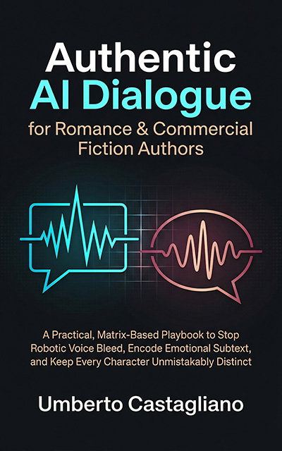

# Authentic AI Dialogue for Romance & Commercial Fiction Authors

***A Practical, Matrix-Based Playbook to Stop Robotic Voice Bleed, Encode Emotional Subtext, and Keep Every Character Unmistakably Distinct***

*A Structured System for Preserving Character Voice, Emotional Depth, and Genre Authenticity in AI-Assisted Dialogue*

You know your characters inside and out. The gruff detective speaks in clipped fragments and leaves sentences unfinished. The witty best friend fires off rapid sarcasm and pop-culture references. The shy heroine's words come out soft and hesitant, full of unfinished thoughts. You can hear each voice as clearly as if they were sitting across from you at a café.

Then you open your AI assistant to brainstorm a dialogue scene, and every character sounds identical. They all speak politely, with measured tones and neutral emotions. It's as if they all went to the same school for pleasant conversation. The detective suddenly speaks in complete, grammatically perfect paragraphs. The sarcastic best friend delivers lines with the warmth of a customer service script. The shy heroine expresses her feelings with the confidence of a TED Talk speaker.

This book solves that problem permanently.

*Authentic AI Dialogue* gives romance and commercial fiction authors a complete, repeatable method for generating dialogue that sounds like your specific characters, in your specific genre, at the exact emotional pitch each scene needs. The system was built for independent authors who release books quickly. Every exercise fits inside a single writing sprint, and every framework works with the tools you already use, like Scrivener and Notion.

## The Problem, Diagnosed Clearly

Before you can fix flattened dialogue, you need to see exactly where and how the flattening happens. Part One of this book gives you that clarity with a five-dimension framework. This framework helps you spot voice convergence in any AI-generated passage. You will learn to examine five things. First, cadence: the musical rhythm of how a character speaks. Second, vocabulary range: the specific words and phrases a character reaches for. Third, sentence-length variance: whether a character favors short bursts or long, winding thoughts. Fourth, emotional register: how much feeling leaks into their word choices. Fifth, conversational rhythm: how they take turns, interrupt, or trail off. Once you can see these five dimensions clearly, the generic "AI voice" turns into a clear set of specific gaps you can fix.

Part One then gives you twelve principle-based prompt modifiers you can apply right away. These modifiers work at the linguistic level, so they transfer cleanly across different AI platforms and model updates. You will never need to relearn your approach every time a new version ships.

## The System, Built Layer by Layer

Part Two is where you build the system step by step. It has five chapters, and each one prepares you for the next.

Start by making a seven-layer psychological profile for each character. This profile pulls out the traits that shape how they speak. Think of it as a vocal fingerprint. You look at their experiences, fears, education, and emotional habits, then turn those details into clear language rules you can use.

Next, turn each profile into a six-field Dialogue Matrix. This matrix is a short set of rules you paste into your AI prompt. It tells the model how the character builds sentences, which words they like, how they show anger or tenderness, and what they would never say. It fits easily into any context window, yet gives you distinct voices on the first try.

Then add a three-tier emotional filter protocol. This adds subtext, tension, and restrained vulnerability to your dialogue prompts. In romance, the real story often lives in what characters almost say, what they hold back, and what slips out anyway. This protocol gives you precise control over that emotional undercurrent in every scene.

The next chapter covers genre calibration. You adjust emotional intensity, density, and pacing to match five major romance sub-genres and eight common scene types. A slow-burn literary romance needs a different dialogue texture than a high-heat contemporary or a cozy romantic mystery. This system helps your AI output match the emotional promise your readers expect from your sub-genre.

The last chapter of Part Two shows you how to assemble everything into a centralized, version-controlled Character Voice Prompt Library. You organize it by series, by character arc stage, and by emotional state. That way, your heroine in book one sounds meaningfully different from your heroine in book four. The library grows with your series and keeps every voice consistent across installments.

## The System, Sustained for the Long Haul

Part Three answers a question every working author eventually asks: how do you keep this system running well across many books, multiple AI model updates, and the natural changes in your characters over time? You will learn a five-minute maintenance ritual for each session that keeps your voice profiles sharp without taking time away from your writing. You will also follow a protocol for responding to model updates, so you can quickly adapt your prompts whenever your AI platform changes. And you will use a series-arc voice evolution guide that shows you how to adjust your Dialogue Matrices as characters grow, heal, break, and transform across a multi-book series.

## Built for the Way You Actually Work

Every framework in this book was designed with real production limits in mind. If you publish six or more titles each year, you cannot spend three hours adjusting one dialogue prompt. The exercises here are made to fit inside the writing sprints you already do. The system relies on language principles that stay stable across AI model updates. So your time spent building these profiles keeps paying off for years.

After you finish the eight-chapter sequence, you will have a documented, version-controlled system for generating dialogue that fits each character at rapid-release speed. Your detective will sound gruff and speak in fragments. Your best friend will crackle with sarcasm. Your shy heroine will trail off mid-sentence, leaving her most important feelings hanging in the silence between words. Every reader who picks up your next book will hear the difference right away.

